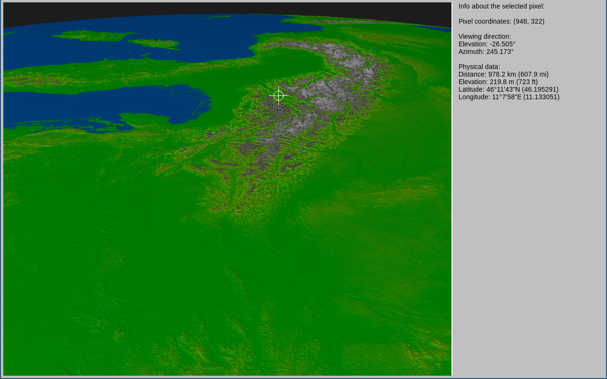

# Atmospheric Raytracer

## What is it?

It's a utility for generating panoramas out of elevation maps. You input a set of elevation maps in
the DTED format, latitude and longitude of the viewing location, viewing altitude, direction, field
of view, and it generates a panorama in the PNG format.

It was created as a means for debunking flat-earthers' arguments, so it supports generating
panoramas as they would look if the Earth was flat, as well. Thanks to this feature, you can
simulate a view of a specific location, compare it to actual photos and see which model fits better
;)

### Metadata

In version 0.4, a way of saving metadata was introduced. The metadata consists of the geographical
coordinates, elevation and distance of each pixel. This data can then be read and displayed by
running `atm-raytracer` with the `view` subcommand (introduced in 0.7). Using this mode, you can
check each individual pixel's information, like the geographical coordinates, distance, and viewing
direction.

To output the metadata, use the `--output-meta` command line option, or the `file_metadata` config
file entry.

## Usage

Since version 0.7, the application contains of two subcommands:

- `gen`, used for generating the images and/or metadata files
- `view`, used for viewing metadata files and inspecting pixel information.

### The `gen` subcommand

Typical usage would be:

1. Download some DTED elevation map files, for example from https://earthexplorer.usgs.gov/
2. Put the DTED files in a single folder
3. Run `cargo run --release -- gen PARAMETERS` (or, if already compiled, `atm-raytracer gen
PARAMETERS`, where the possible parameters are:

* `-c, --config PATH` - path to a YAML config file, defining any of the values described below.

If both a config file and other parameters are supplied, the command line parameters override the
values defined in the YAML config.

* `-t, --terrain PATH` - path to a folder containing files in DTED format

View options:

* `-a, --alt ALT` - viewpoint altitude in meters ASL
* `-l, --lat DEG` - viewpoint latitude in degrees
* `-g, --lon DEG` - viewpoint longitude in degrees
* `-d, --dir DEG` - viewing direction azimuth in degrees (0 = north, 90 = east etc.)
* `-e, --elev DEG` - viewing direction elevation in degrees; 0 means the observer's eye looks horizontally, -1 is one degree below horizontal etc.
* `-f, --fov DEG` - horizontal field of view in degrees (the vertical FOV is scaled based on the output image width and height)
* `-m ,--maxdist DIST` - cutoff distance - objects further than this won't be visible

Simulation environment options:

* `-R, --radius RADIUS` - the Earth's simulated radius, conflicts with `--flat`
* `--flat` - use the `FlatDistorted` model (calculating light paths like on a flat surface with slightly distorted distances); conflicts with `--radius`
* `-s, --straight` - propagate light rays along straight lines (by default the rays are bent according to the atmospheric temperature and pressure)
* `--step STEP` - when simulating a light ray, a single simulation step will be by this many meters

Output options:

* `-o, --output PATH` - the resulting image will be saved under this name
* `--output-meta PATH` - metadata will be save in a file under this name
* `-w, --width PIXELS` - the output image width in pixels
* `-h, --height PIXELS` - the output image height in pixels

### YAML config

The example config below illustrates the usage:

```yaml
# scene settings:
scene:
    # the path to the folder with terrain data
    terrain_folder: /home/user/atm-raytracer/terrain
    # any objects defined on the scene
    objects:
        # A Billboard - a textured rectangle
        # the object's position first
        - position:
            latitude: 1.2345
            longitude: -3.45678
            altitude:
                Absolute: 8.0
          # Color is not used for billboards
          color:
            r: 0.5
            g: 0.0
            b: 0.0
          shape:
            Billboard:
                # width and height define the dimensions
                width: 164.125
                height: 65.0
                # path to the texture
                # textures can take advantage of transparency
                texture_path: ./texture.png
        # A simple, single-colored cylinder
        - position:
            latitude: 1.3456
            longitude: -3.5678
            altitude:
                Relative: 0.0
          # Color matters this time
          color:
            r: 0.5
            g: 0.0
            b: 0.5
            # It can be translucent - alpha is assumed to be 1.0 if omitted
            # a: 0.5
          shape:
            Cylinder:
                # A cylinder has a radius and a height
                radius: 3.0
                height: 55.0

# view configuration
view:
    # the position of the observer
    position:
        # latitude and longitude in degrees
        latitude: 49.979439
        longitude: 21.622839
        altitude:
            # can be either:
            # Absolute: x
            # or
            # Relative: x
            # Absolute defines the view point at x meters ASL. Relative is above the terrain.
            Relative: 2
    # Frame definition: viewing direction, FoV, camera tilt, cutoff distance
    frame:
        # viewing azimuth; 0 = north, 90 = east, 180 = south, 270 = west
        direction: 231
        # horizontal field of view in degrees
        fov: 4
        # rays will not be propagated further than this distance from the observer (in meters)
        max_distance: 200000
        # camera tilt relative to horizontal, in degrees; 1 = tilted one degree up
        tilt: 0
    # Coloring method: currently two methods are available: Simple and Shading
    # The Simple method assigns colors to pixels based on their distance and elevation.
    # The Shading method simulates directional lighting from a defined direction
    # The Simple method only has one parameter, the water level. An example of the Shading method
    # is shown below.
    coloring:
        Shading:
            # the elevation of the water level
            # this is 0.0 (the sea level) by default, but if there is a lake in the frame instead
            # of the sea, it might be desirable to set this to the elevation of the lake
            water_level: 0.0
            # the intensity of ambient lighting
            # if set to 0, only directional lighting is used, and all surfaces reached by light at
            # an angle of 90 degrees or more will be black
            # default is 0.4
            ambient_light: 0.4
            # the zenith angle of the direction of light; 0.0 means light coming directly from the
            # zenith, 90.0 means lighting akin to sunrise/sunset (light rays parallel to horizontal)
            # default is 45.0
            light_zenith_angle: 50.0
            # the horizontal direction of light rays; 0.0 means lighting directly from behind the
            # observer; positive values mean light coming from the right, negative - from the left
            # default is 0.0
            light_dir: 10.0
    # The characteristic distance of the fog. Light is attenuated by a factor of e every such
    # distance from the observer. If omitted, there is no fog (infinite distance).
    fog_distance: 100000

# the shape of the simulated Earth
# can be either of:
# * earth_shape: AzimuthalEquidistant
#   (calculates everything according to the AE model)
# * earth_shape: FlatDistorted
#   (calculates light paths like on a flat surface, but distorts distances according to latitude)
# * earth_shape:
#     FlatSpherical:
#       radius: x (in meters)
#   (calculates light paths like on a flat surface, but distances like on the spherical model)
# * earth_shape:
#     Spherical:
#       radius: x (in meters)
#   (calculates everything like on a globe)
earth_shape:
    Spherical:
        radius: 6371000

# straight_rays: if true, rays are just propagated along straight lines.
# if false, actual light propagation equations are used
straight_rays: false

# a single propagation step advances the ray by this many meters
# the lower this value, the more accurate the rendering is, but the longer it takes
simulation_step: 50

# output options
output:
    # image width in pixels
    width: 960
    # image height in pixels
    height: 600
    # location in which the output will be saved
    file: ./output.png
    # location in which metadata will be saved
    file_metadata: ./output.dat
    # optional ticks marking the azimuths; multiple definitions are possible
    # a definition is either "Single" - a single tick at a specific azimuth - or "Multiple" -
    # multiple ticks separated by some step, and shifted by some constant ("bias")
    # example config below
    ticks:
      # a tick every 10 degrees, not shifted (bias = 0), so ticks will be at 0, 10, 20 etc.
      - Multiple:
          # number of degrees by which to shift the ticks
          bias: 0
          # step size: every 10 degrees
          step: 10
          # ticks will be 10 pixels in size
          size: 10
          # ticks will be labelled (with a number representing the azimuth)
          labelled: true
      # another definition of multiple ticks
      # these are every 2 degrees, so some will fall on the same azimuths as the previously defined
      # ones - in such a case, the larger tick takes precedence
      - Multiple:
          bias: 0
          # smaller step - every 2 degrees
          step: 2
          # smaller size - so the ticks every 10 degrees will override these ones
          size: 5
          # these ones will not be labelled
          labelled: false
      # a single tick at azimuth 45
      - Single:
          azimuth: 45
          size: 15
          labelled: true
    # whether to show a line representing the eye level (the horizontal direction)
    show_eye_level: true
    # The generating algorithm to be used - there are three options:
    # - Fast - faster, but introducing distortions in the picture (negligible with small fields of
    # view near horizontal
    # - Rectilinear - simulating a view through a rectilinear lens, but up to a few times slower
    # - InterpolatingRectilinear - a faster, but slightly less accurate version of Rectilinear
    # The default is Fast.
    generator: Fast

# atmosphere structure definition
# if this isn't present, a US-76 atmosphere is assumed
atmosphere:
    # Pressure fixed point (a value at a given altitude):
    pressure:
        altitude: 0.0
        # pressure in Pa (pascals)
        pressure: 101325
    # a definition of the temperature function that will be used for altitudes from -infinity up to
    # the first altitude defined in next_functions
    first_temperature_function:
        # can be either "Linear" or "Spline"; an example of "Spline" below
        Linear:
            gradient: -0.0065
    next_functions:
        # next function will be used at altitudes 100.0 and above
        - altitude: 100.0
          function:
            Spline:
                boundary_condition:
                    # Can be "Natural", "Derivatives" with two numbers, or "SecondDerivatives" with two numbers
                    # The example below sets the boundary condition so that the initial derivative should be
                    # -0.0065, and the final derivative should be 0.0
                    Derivatives:
                        - -0.0065
                        - 0.0
                # A list of pairs (altitude, temperature)
                points:
                    -
                        - 100.0
                        - 288.0
                    -
                        - 110.0
                        - 285.0
                    -
                        - 120.0
                        - 291.0
    # if there are only Linear variants among function definitions, nothing defines the value of temperature
    # itself at any point, so it has to be additionally defined here; if at least one Spline is used, this
    # shouldn't be present:
    # temperature_fixed_point:
    #     altitude: 0.0
    #     temperature: 288.0
```

### The `view` subcommand

This subcommand only takes a single parameter, the path to the metadata file, so the typical usage will be:

`cargo run --release -- view metadata.dat`

or

`atm-raytracer view metadata.dat`

(`metadata.dat` being an example name of the metadata file.)

This launches a GUI application which displays the generated image. Initially no pixel information is
being displayed, because no pixel is selected. To select a pixel, hit the spacebar while hovering over
it with the mouse. Esc deselects the pixel. You can pan the view by dragging it with the mouse, and
zoom in and out using the scroll wheel.

Screenshot:


